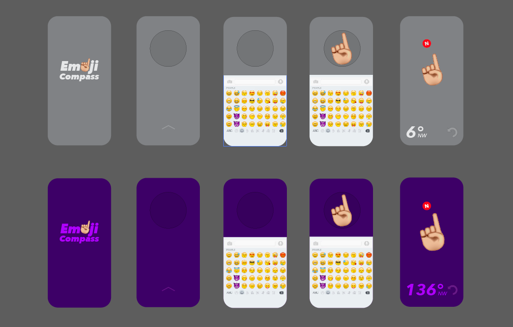

# 

## Why Create
Always have an idea to use emoji as the object & point to the right direction😆

## Description
A simple react-native compass app

## Deploy link
https://expo.io/@nick2018/emoji-compass

(Click the link above & get to the page, then type your email to request a temporary link on the right side of the page) 
I know it's so weird, but that's how expo do... Otherwise, you can just take a look at my intro video below for a quick glance of this project😊

## Intro Video

## Interface Sample

## Key Featrues
(1). Variety choice of emoji library 
(2). Funny emoji compass 
(3). Day/Night different background scene 
